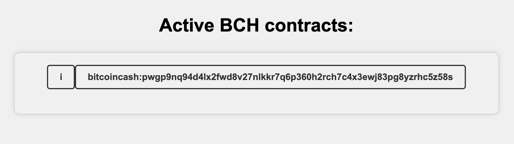
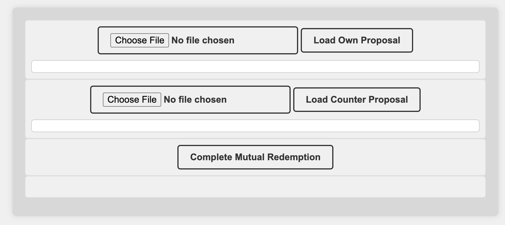
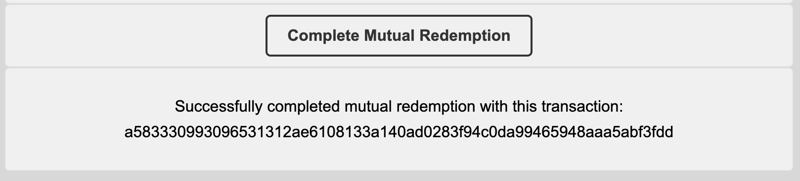

## Installing the project
Just run `npm install` in the root of the project.

Commands availabe:
```
npm start - run the server with the main utility
npm test - generates a p2p contract
```


# 1. Creating a p2p contract
Create a `.env` file in the root of the project and add the
following information:

- Nominal Units: amount in USD cents for the contract.
- Contract duration in seconds: time in seconds the contract will have.
- Low liquidation multiplier. 
- High liquidation multiplier.
- Peer1_short_private_key: key of the short side.
- Peer2_long_private_key: key of the long side.

Pd: You can generate private keys using the section Addresses of
the Electron-Cash Wallet. (Right click in one address and 'get private key' option).


#### **`.env`**
```
NOMINAL_UNITS=20
CONTRACT_DURATION_IN_SECONDS=3600
LOW_LIQUIDATION_MULTIPLIER=0.75
HIGH_LIQUIDATION_MULTIPLIER=1.25
PEER1_SHORT_P_KEY=***********************************
PEER2_LONG_P_KEY==***********************************
```

Once you have this information you can run `npm test` to create a contract, the information of the contract will appear in the console.

Output example: 
```
Registered 'bitcoincash:pwgp9nq94d4lx2fwd8v27nlkkr7q6p360h2rch7c4x3ewj83pg8yzrhc5z58s' for automated settlement after funding is complete.
Technical contract details:
{
  version: 'AnyHedge v0.12',
  address: 'bitcoincash:pwgp9nq94d4lx2fwd8v27nlkkr7q6p360h2rch7c4x3ewj83pg8yzrhc5z58s',
  parameters: {
    maturityTimestamp: 1720892924n,
    startTimestamp: 1720889301n,
    highLiquidationPrice: 46393n,
    lowLiquidationPrice: 27836n,
    payoutSats: 71849n,
    nominalUnitsXSatsPerBch: 2000000000n,
    satsForNominalUnitsAtHighLiquidation: 0n,
    oraclePublicKey: '02d09db08af1ff4e8453919cc866a4be427d7bfe18f2c05e5444c196fcf6fd2818',
    longLockScript: '76a91441573582ac9234de6b2ac6b44c8c02369c6c805388ac',
    shortLockScript: '76a91425b1cf7d5347fc50c1af091461fbe5a6362b540888ac',
    enableMutualRedemption: 1n,
    longMutualRedeemPublicKey: '02f9f412cd382e6ef4081d615e26bbb4329a776fea6c1d8936161c32a4c8830853',
    shortMutualRedeemPublicKey: '039f0aed17e66767b6df78d96066e31f90d9e38d420847ef8c213c10ae605ccd7c'
  },
  metadata: {
    takerSide: 'short',
    makerSide: 'long',
    shortPayoutAddress: 'bitcoincash:qqjmrnma2drlc5xp4uy3gc0muknrv265pqhzp2ez0m',
    longPayoutAddress: 'bitcoincash:qpq4wdvz4jfrfhnt9trtgnyvqgmfcmyq2vummy8yjd',
    startingOracleMessage: 'd5af92662aa30a0013a30a00fa900000',
    startingOracleSignature: '6b319b5280b9b0b0ca7668c84aa26536c87c5b3977900fbf363cfe3c2d7eb465ac023cf1c750ed1840b6221aa3e7ed1b47a58afdd24857e843d9ef063f50a3e9',
    durationInSeconds: 3623n,
    highLiquidationPriceMultiplier: 1.25,
    lowLiquidationPriceMultiplier: 0.75,
    isSimpleHedge: 1n,
    startPrice: 37114n,
    nominalUnits: 20,
    shortInputInOracleUnits: 19.99999232,
    longInputInOracleUnits: 6.66604554,
    shortInputInSatoshis: 53888n,
    longInputInSatoshis: 17961n,
    minerCostInSatoshis: 633n
  },
  fundings: [],
  fees: [
    {
      address: 'bitcoincash:qrnu9m7wnca4l328x3uel0z2ghuykk2j6gsl4uw0wc',
      satoshis: 1332n,
      name: 'Settlement Service Fee',
      description: 'Validates contract parameters and then monitors the contracts oracle prices and automates settlement.'
    }
  ]
}
Funding transaction: 020000000361a578e1c94939f2d80160916487ca3e10fd7c46f02f771f101eb0623a88830f0200000064415e1bffa3038c70b91c359231ed4aa879564c5a060d51eafa6c5488d0d831cb27687ef011d410cea452b3bbac3a2d8006b328a3963d51372803f7886cf082db6a4121039f0aed17e66767b6df78d96066e31f90d9e38d420847ef8c213c10ae605ccd7c00000000103e8677fe362e11288c942368a2801c9c951fbdb61e7e3ab7e9c2cd29bccf08000000006441bebff5dbbdbbfdeb2b0197bbbe58059fe973ab181ef4d8d4f8ce1d8630354ff3e739593703b11bd5f32aa2705a8f8f1534e1c2d6ffbacd14ac3648351c4e9e2d4121039f0aed17e66767b6df78d96066e31f90d9e38d420847ef8c213c10ae605ccd7c000000000a8501bdbf0f7481874fc31756325bb8e5a04721ebd66e73734d55608077d315000000006441b84a02184b94a5d6304cb5fd8fccf38f3eb095dbb313db9d7ab74bd0700c4573ba9a68b38dc63e54f48bdaa71de3cdc02e8bc9c1362c06cb52419ad15ad56a3c412102f9f412cd382e6ef4081d615e26bbb4329a776fea6c1d8936161c32a4c88308530000000004562001000000000023aa209012cc05ab6bf3292e69d8af4ff6b0fc0d063a7dd43c5fd8a9a39748f10a0e418734050000000000001976a914e7c2efce9e3b5fc54734799fbc4a45f84b5952d288ac88410000000000001976a91425b1cf7d5347fc50c1af091461fbe5a6362b540888acb7c90300000000001976a91441573582ac9234de6b2ac6b44c8c02369c6c805388ac00000000
Wait for 3600 seconds(s) and the redemption service should mature your contract, paying out to short (bitcoincash:qqjmrnma2drlc5xp4uy3gc0muknrv265pqhzp2ez0m) and long (bitcoincash:qpq4wdvz4jfrfhnt9trtgnyvqgmfcmyq2vummy8yjd).
```

# 2. Using the utiliy

For testing purposes you can create a file called `p2p_testing.csv` and put the following information, here we are using the contractAddress of the contract generated in the first step.

#### **`p2p_testing.csv`**
```
contractAddress,settlementTxId
bitcoincash:pwgp9nq94d4lx2fwd8v27nlkkr7q6p360h2rch7c4x3ewj83pg8yzrhc5z58s,
```

Here we are replicating the column names of the csv file given by BCHBULL in the export function

Now, in your `.env` file add this information:

Authentication token: a token given by AnyHedge server, you can get one doing:
```
curl -d 'name=My name' "https://api.anyhedge.com/api/v2/requestToken"
```
Private_key: Here put the private key of one of the sides (short or long)

File path: The location of your csv file.

Example:
```
AUTHENTICATION_TOKEN=*******************************
PRIVATE_KEY=*******************************
FILE_PATH='.files/p2p_testing.csv'
```

Now you can run `npm start` to use the utility.

## A. Main screen 


Here you can see the list of contracts that are active currently (from the list in csv option they are filtered checking the ones without settlement information). You can click in one of them to check the settlement utilities.

## B. Settle utilities
In this page, you have two sections, one to generate the Mutual Redemption proposal, and another to load the
generated proposals to complete the mutual redemption.

### Generate proposal

In this section you can generate a proposal entering a price in USD, or you can leave it blank to ask for a refund.
When clicking the button, it will download a file.

File example for a refund (no price specified):

#### **`bitcoinXXXXX.json`**
```
{
    "inputs": [
        {
            "txid": "4ff149908a2c3554abef8e72b7434137e15d4edfebd57ebc704ca3bcb280d341",
            "vout": 0,
            "satoshis": "<bigint: 73814n>"
        }
    ],
    "outputs": [
        {
            "to": "bitcoincash:qqjmrnma2drlc5xp4uy3gc0muknrv265pqhzp2ez0m",
            "amount": "<bigint: 53888n>"
        },
        {
            "to": "bitcoincash:qpq4wdvz4jfrfhnt9trtgnyvqgmfcmyq2vummy8yjd",
            "amount": "<bigint: 17961n>"
        }
    ],
    "redemptionDataList": [
        {
            "short_key.schnorr_signature.all_outputs": "e33c66d6d26ee469e169a5a232432930606e1929631e120d7821e9e1f3240629dcd6bdc9a093aa135fac9290901fb3006ce54698fa3ad4a02890e9c005a90f4f41"
        }
    ]
}
```

You can replicate this step, but using the other private key (either short or long side),
so you can have the two files for the next section, update your `.env` file updating the PRIVATE_KEY information.

### Completing mutual redemption.


In this section you need to load both proposal (own and counterparty), to complete a mutual redemption.
Once loaded the files, you can press the button `Complete Mutual redemption`.

The page will show a message indicating that the redemption was succesful, and you can check 
your balance in your testing wallets to check that the funds were refunded.




So, we have a functional utility, where if some day the BCHbull servers fail we can 
contact the liquidity provider, so both can generate a proposal and we can get
a mutual redemption.