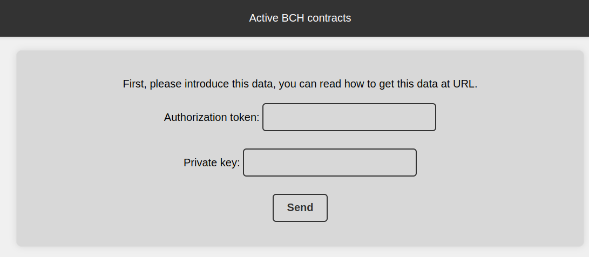
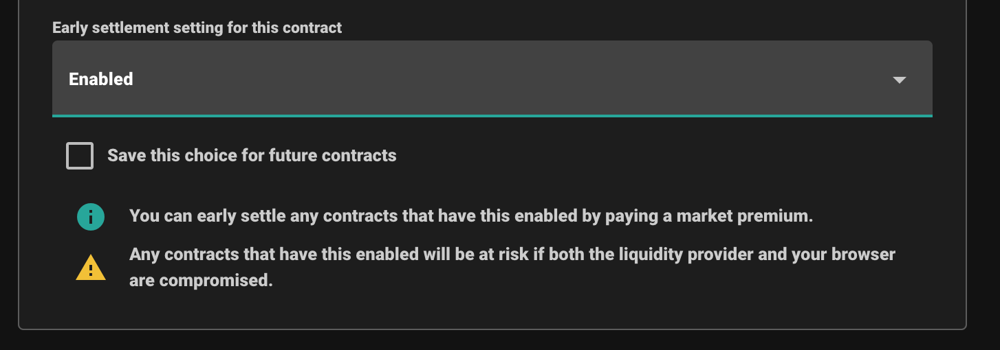
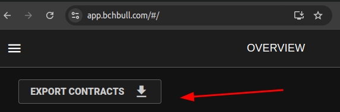
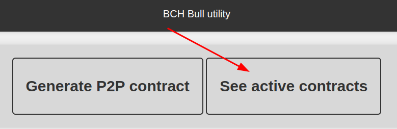
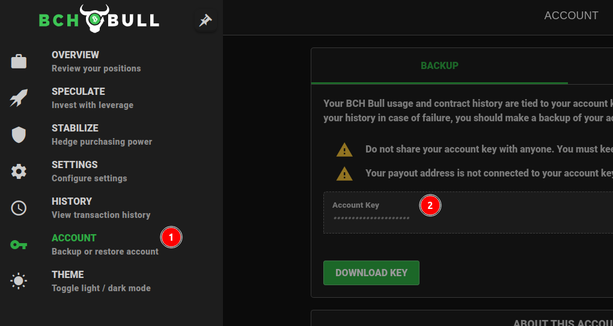
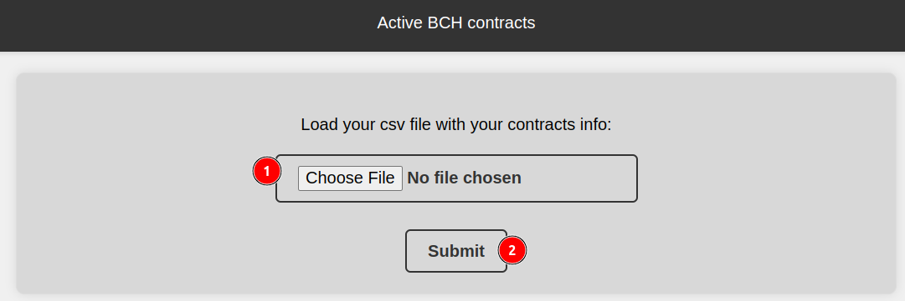
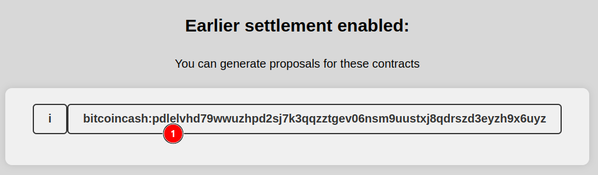
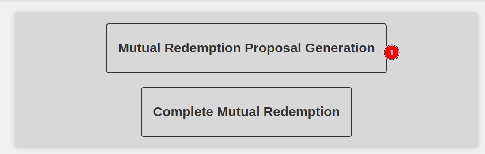
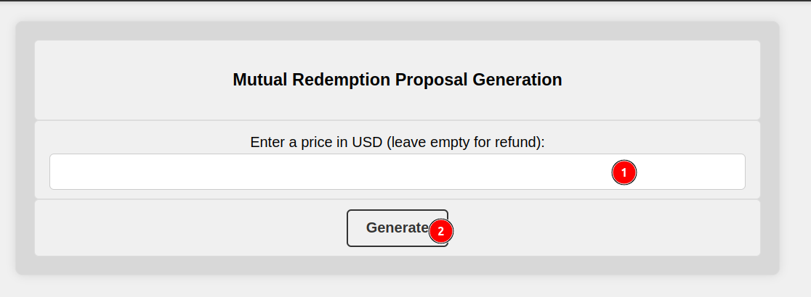
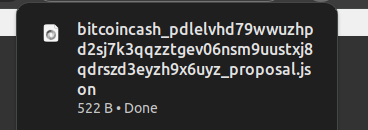

# 1. First steps
## A. How to get credentials

- How to get an authentication token:
 
Authentication token: a token given by AnyHedge server, you can get one doing:
```
curl -d 'name=My name' "https://api.anyhedge.com/api/v2/requestToken"
```

- How to get private keys: 

Open the electron cash wallet, and use the Addresses tab.


Copy private key of an address with enough funds.


## B. How to use the project
### a. Local Mode .
- Clone the repository
 ```
git clone https://github.com/henryf3/bch_mutual_redemption_tool.git
```

- Run the commands in terminal
 ```
npm install
npm start
```
### b. Using the web
Just open the web page: 

```
https://bchmutualredemption.adaptable.app/
```
# 2. The Tool

### A. Creating a p2p contract
In this screen you need to add the following information:

- Nominal Units: amount in USD cents for the contract.
- Contract duration in seconds: time in seconds the contract will have.
- Low liquidation multiplier. 
- High liquidation multiplier.
- Peer1_short_private_key: key of the short side.
- Peer2_long_private_key: key of the long side.
- Authentication Token: token for AnyHedge API


 
Once you have this information you can use the `Send` button to create a contract, a message will appear here.


### B. See active contracts

For testing purposes you can create a file called `p2p_testing.csv` and put the following information, here we are using the contractAddress of the contract generated in the p2p option. Here we are replicating the column names of the csv file given by BCHBULL in the export function

#### **`p2p_testing.csv`**
```
contractAddress,settlementTxId
bitcoincash:pwgp9nq94d4lx2fwd8v27nlkkr7q6p360h2rch7c4x3ewj83pg8yzrhc5z58s,
```

Or you can use the csv file provided by bchbull.

#### B1. Add credentials 
Here you need to add your Authorization token
and your private key (the one provided by BCHbull or the one of your wallet if you created a p2p contract).



#### B2. Load csv file
Here you need to load your csv file with the contracts information


#### B3. See Active contracts


Here you can see the list of contracts that are active currently (from the list in csv option they are filtered checking the ones without settlement information). You can click in one of them to check the settlement utilities.

#####  B3_1. Settle utilities
In this page, you have two sections, one to generate the Mutual Redemption proposal, and another to load the
generated proposals to complete the mutual redemption.

###### Generate proposal

In this section you can generate a proposal entering a price in USD, or you can leave it blank to ask for a refund.
When clicking the button, it will download a file.

File example for a refund (no price specified):

**`bitcoinXXXXX.json`**
```
{
    "inputs": [
        {
            "txid": "4ff149908a2c3554abef8e72b7434137e15d4edfebd57ebc704ca3bcb280d341",
            "vout": 0,
            "satoshis": "<bigint: 73814n>"
        }
    ],
    "outputs": [
        {
            "to": "bitcoincash:qqjmrnma2drlc5xp4uy3gc0muknrv265pqhzp2ez0m",
            "amount": "<bigint: 53888n>"
        },
        {
            "to": "bitcoincash:qpq4wdvz4jfrfhnt9trtgnyvqgmfcmyq2vummy8yjd",
            "amount": "<bigint: 17961n>"
        }
    ],
    "redemptionDataList": [
        {
            "short_key.schnorr_signature.all_outputs": "e33c66d6d26ee469e169a5a232432930606e1929631e120d7821e9e1f3240629dcd6bdc9a093aa135fac9290901fb3006ce54698fa3ad4a02890e9c005a90f4f41"
        }
    ]
}
```

You can replicate this step, but using the other private key (either short or long side),
so you can have the two files for the next section, update your `.env` file updating the PRIVATE_KEY information.

###### Completing mutual redemption.


In this section you need to load both proposal (own and counterparty), to complete a mutual redemption.
Once loaded the files, you can press the button `Complete Mutual redemption`.

The page will show a message indicating that the redemption was succesful, and you can check 
your balance in your testing wallets to check that the funds were refunded.


So, we have a functional utility, where if some day the BCHbull servers fail we can 
contact the liquidity provider, so both can generate a proposal and we can get
a mutual redemption.

# 3. How to use in case of BCH Bull Servers are down
## Prerequisites:
You need to take into account this:
- Have your contracts address information, you can get it from the export function in BCHBull (see next section for details).
- Have your BCHBull private key backed up (see how to get it at [this section](#d-set-your-credentials)). 
- Have contracts created with Early Settlement option ENABLED, this is mandatory to be able to settle contracts earlier.




## A. Get your csv file from BCHBull export function.

You need to keep this file as updated as possible (maybe try to get a new file version every time after generating a new contract). 



## B. Decide how are you gonna use the tool

You have two options: 

- Online version: you will have to create a new BCHBull account after using this version for security reasons.
- Local version.

More details about how to use it at [section](#b-how-to-use-the-project).


## C. Use the option 'See active contracts' from the main menu



## D. Set your credentials


Here you need to add:

- Authorization token: (check how to generate one at [section](#a-how-to-get-credentials))
- Private key: the private key that you can get in the Account section of BCHBUll (must be the same account where you generate the contracts and where you downloaded the csv file.)



## E. Load your csv file 
Here you need to load the csv file downloaded from Export funcion from BCHBull.



## F. Generate your own mutual redemption proposal.
In this screen you need to select the contract you want to generate a proposal.





In this screen you need to specify a price (the one accorded with the Liquidity provider, or leave it blank if you want to propose a refund)



When you pulse generate, a file will be downloaded in your pc.



## G. Share your proposal with the Liquidity provider.

Now, you just need to share your proposal with your liquidity provider so they can:

- A. Generate their counterparty proposal (using the option explained in the previous lines)
- B. Complete the mutual redemption, following the steps provided in [section](#completing-mutual-redemption).

